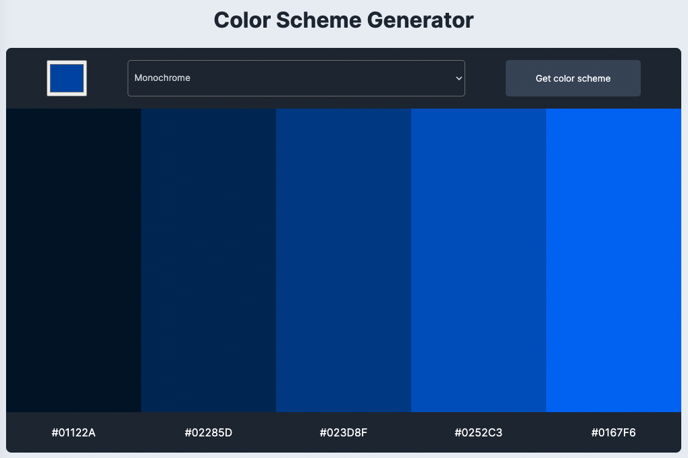

# Color Scheme Generator

A solo project from the [Scrimba Frontend Developer Career Path](https://scrimba.com/learn/frontend)

## Table of Contents

- [Overview](#overview)
  - [Requirements](#requirements)
  - [Screenshots](#screenshots)
  - [Links](#links)
  - [Built with](#built-with)
- [Future Goals](#future-goals)

## Overview

### Requirements

- [x] Choose "seed color" with an \<input type="color"/>
- [x] Choose color scheme mode in a \<select> box
- [x] Clicking button makes request to The Color API to get a color scheme
- [x] Display the scheme colors and hex values on the page
- [x] Stretch goal: click to copy hex values to clipboard

### Screenshots

### Links

- Live Site URL: [GitHub Pages](https://xchristinawu.github.io/color-scheme-generator/)

### Built with

- HTML, CSS, JavaScript
- [The Color API](https://www.thecolorapi.com/)

## Future Goals
- Add area for hex value input
- Display a tooltip on click instead of alert

